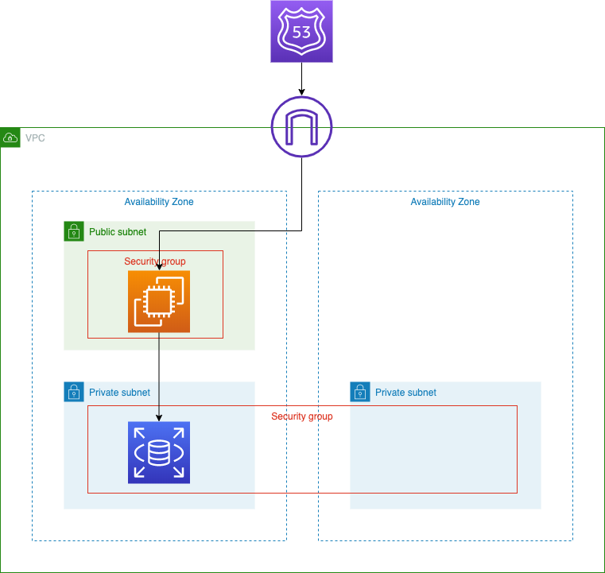

## What this...

CFnの練習。WordPressの最小構成での稼働環境を作る。

## Infrastructur Image



## Usage

### Create stack

```sh
$ aws cloudformation create-change-set --template-body file://templates/stack-vpc.yml --cli-input-json file://parameters/stack-vpc.json --change-set-type CREATE
$ aws cloudformation create-change-set --template-body file://templates/stack-security-group.yml --cli-input-json file://parameters/stack-security-group.json --change-set-type CREATE
$ aws cloudformation create-change-set --template-body file://templates/stack-ec2-web.yml --cli-input-json file://parameters/stack-ec2-web.json --change-set-type CREATE
$ aws cloudformation create-change-set --template-body file://templates/stack-rds.yml --cli-input-json file://parameters/stack-rds.json --change-set-type CREATE
```

### Create change set

```sh
$ aws cloudformation create-change-set --template-body file://templates/stack-vpc.yml --cli-input-json file://parameters/stack-vpc.json
$ aws cloudformation create-change-set --template-body file://templates/stack-security-group.yml --cli-input-json file://parameters/stack-security-group.json
$ aws cloudformation create-change-set --template-body file://templates/stack-ec2-web.yml --cli-input-json file://parameters/stack-ec2-web.json
$ aws cloudformation create-change-set --template-body file://templates/stack-rds.yml --cli-input-json file://parameters/stack-rds.json
```

### Execute Change set

```sh
$ aws cloudformation execute-change-set --change-set-name {Id}
```
